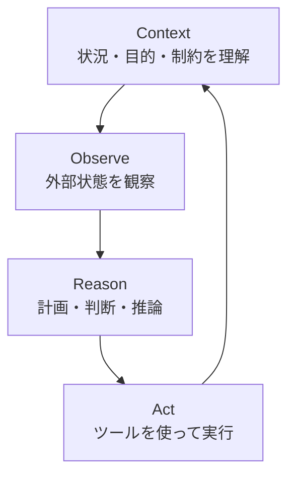
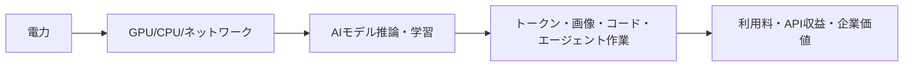
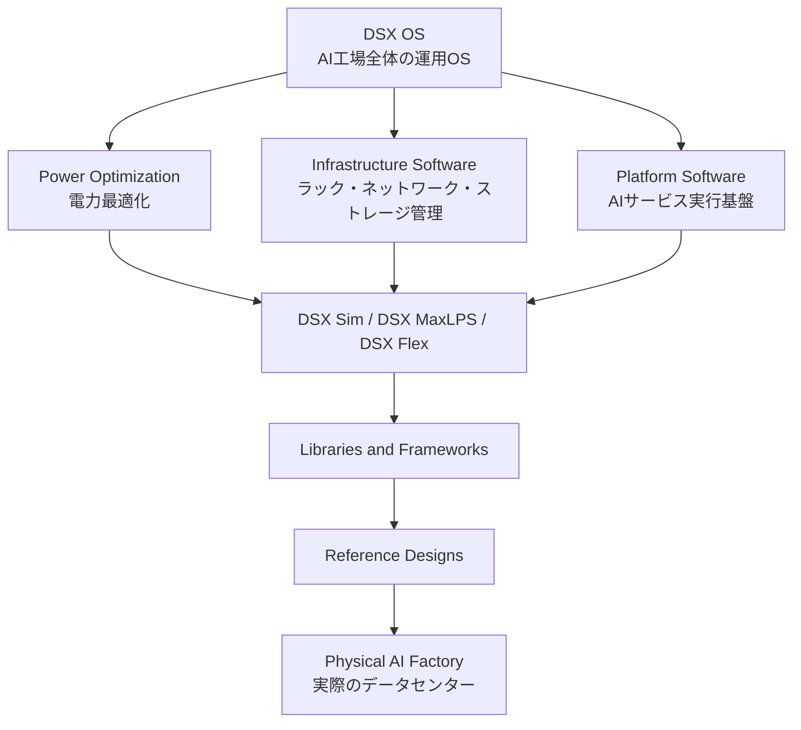
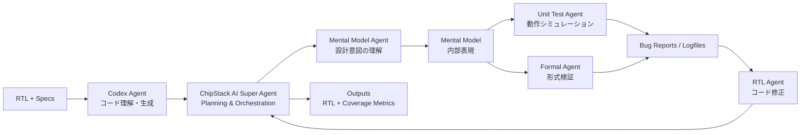
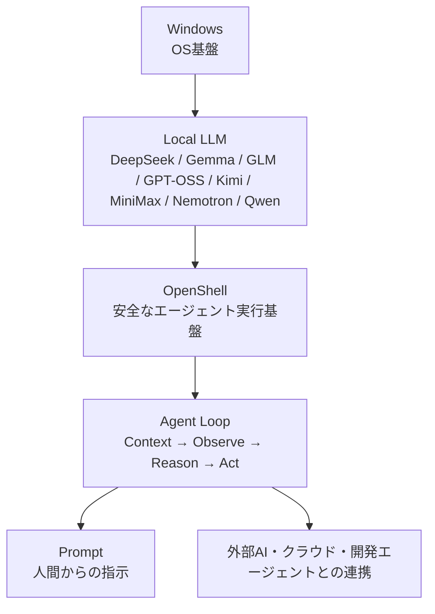
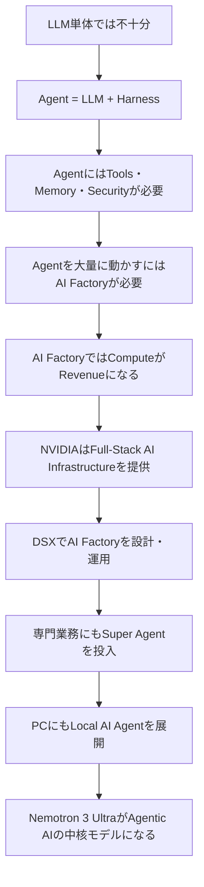

# NVIDIA GTC Taipei 2026 学生向け解説ノート

> **テーマ：AIは「チャットボット」から「エージェント」「AI工場」「ローカルAI PC」へ**  
> 対象：AI・情報系・経営・社会科学・デザイン系の学生にもわかる入門〜中級レベル

---

## 0. この資料の使い方

このMarkdownは、2026年6月1日に台湾・台北で行われた **NVIDIA GTC Taipei 2026 Keynote** のスライド写真をもとに、ほかの学生へ説明しやすい形に再構成したものです。  
一部、画像から読み取れた情報に加えて、NVIDIA公式資料・公式ドキュメント・報道資料を補足しています。

> **注意**  
> スライド写真から読み取れる文字には一部不鮮明な箇所があります。以下では、読み取りが確実な部分を中心に説明し、推測を含む箇所はできるだけ「〜と考えられる」と表現しています。

---

## 1. まず全体像：NVIDIAが語っている未来

今回の一連のスライドで強調されているのは、単なる「GPU性能」ではありません。むしろ、次のような大きな転換です。

<div style="border:1px solid #9acd32; border-radius:12px; padding:16px; background:#111; color:#f5f5f5;">

### NVIDIAのメッセージ

**AIは、モデル単体の時代から、エージェント・インフラ・工場・PC・専門業務に広がる時代へ進んでいる。**

</div>

NVIDIAは、GTC Taipei 2026の基調講演を「次世代AIを駆動するブレイクスルー」を発表する場として位置づけていました。公式ページでは、Jensen Huang CEOによるキーノートが **2026年6月1日 午前11時（台北時間）** に Taipei Music Center で行われると案内されています。[^gtc]

この内容を学生向けに一言で表すなら、次のようになります。

> **AIの価値は、LLMそのものだけでなく、LLMを安全に動かし、道具を使わせ、巨大な計算基盤で支え、個人PCや専門業務へ展開する「総合システム」に移っている。**

---

## 2. Slide 1：AGENT = LLM + HARNESS

### 2.1 スライドの中心メッセージ

最初の重要なスライドは、次の式でした。

```text
AGENT = LLM + HARNESS
```

これはとても重要です。多くの人は「AIエージェント = ChatGPTみたいなLLM」と考えがちですが、NVIDIAの説明ではそうではありません。

| 要素 | 役割 | たとえ |
|---|---|---|
| **LLM** | 言語理解・推論・生成を行う中核モデル | 脳、思考エンジン |
| **Harness** | LLMを現実の作業に接続する実行基盤 | 手足、作業台、管理システム |
| **Agent** | 目的を理解し、道具を使い、行動するシステム | 作業者、秘書、研究助手 |

つまり、エージェントは **賢い文章生成AI** ではなく、**作業を実行するシステム** です。

---

### 2.2 エージェントの基本ループ

スライド中央には、次のようなループが描かれていました。



#### Context：文脈を理解する

ユーザーの依頼、過去の会話、現在のファイル、作業目的、制約条件などを整理します。

#### Observe：観察する

ファイルを読む、ブラウザを見る、コード実行結果を確認する、データベースを検索するなど、外部環境の状態を取り込みます。

#### Reason：考える

何をすべきか、どの順番で進めるべきか、どのツールを使うべきかを判断します。

#### Act：行動する

メールを作る、コードを書く、ファイルを編集する、APIを呼ぶ、シミュレーションを実行するなどの行動をします。

---

### 2.3 周辺要素：Prompt / Orchestration / Tools / Security / Memory

スライドの周囲には、エージェントを成立させるための要素が配置されていました。

| 要素 | 説明 |
|---|---|
| **Prompt** | ユーザーからの自然言語指示。エージェントの入口。 |
| **Orchestration** | 複数の処理やツール呼び出しを順番に組み立てる制御機構。 |
| **Tools & Skills** | 検索、計算、コード実行、メール、カレンダー、CAD、EDAなどの外部能力。 |
| **Security & Governance** | 権限管理、監査、ポリシー、データ保護、人間の承認など。 |
| **Memory** | 短期記憶・長期記憶。過去の作業、ユーザーの好み、プロジェクト情報を保持。 |

NVIDIAは、Agent Toolkitの一部として **OpenShell** というオープンソースランタイムを説明しており、これは自律エージェントに対してポリシーベースのセキュリティ、ネットワーク、プライバシーのガードレールを提供するものとされています。[^agent-toolkit] GitHub上のOpenShell説明でも、サンドボックス実行環境やYAMLポリシーにより、ファイルアクセス、データ流出、無制御なネットワーク活動を防ぐと説明されています。[^openshell]

---

## 3. Slide 2：COMPUTE IS REVENUE — 計算能力は売上である

### 3.1 スライドの中心メッセージ

次のスライドには、大きくこう書かれていました。

```text
COMPUTE IS REVENUE
```

これは、AI時代のデータセンターでは、計算資源が単なるコストではなく、**売上を生む生産設備** になるという意味です。

NVIDIAのNewsroomでも、Jensen Huang CEOは「知能トークンは新しい通貨であり、AI factoryはそれを生成するインフラである」という趣旨の発言をしています。[^vera-rubin-dsx]

---

### 3.2 AI Factory Revenue：AI工場の収益

AI Factoryとは、AIモデルを動かし、トークン・画像・コード・検索結果・エージェント作業結果などを大量に生成するデータセンターです。

従来のデータセンターは「サーバーを置く場所」というイメージでした。  
AI時代のデータセンターは、NVIDIAの文脈では **トークンを生産する工場** として捉えられています。



---

### 3.3 収益を左右する4つの指標

スライドには、AI Factoryの収益を広げる要因として、次のような指標が示されていました。

| 指標 | 意味 | 収益への影響 |
|---|---|---|
| **TTFT** | Time To First Token。ユーザーが入力してから最初のトークンが返るまでの時間。 | 短いほど応答が速く、体験が良くなり、処理量も増える。 |
| **Tokens/Watt** | 電力1ワットあたり何トークン生成できるか。 | 高いほど電力コストあたりの売上が増える。 |
| **MTBI** | Mean Time Between Interruptions / Incidents と考えられる。中断・障害までの平均時間。 | 長いほどサービスが止まりにくく、稼働率が上がる。 |
| **Useful Life** | ハードウェアやソフトウェア基盤が価値を生み続ける期間。 | 長いほど投資回収期間が伸びる。 |

---

### 3.4 スライド上部の3行の意味

```text
EXTREME CO-DESIGN — TTFT, TOKEN/WATT
SCALE & EXPERIENCE — TTFT, MTBI
CUDA ECOSYSTEM & INSTALLED BASE — USEFUL LIFE
```

#### Extreme Co-Design

GPU、CPU、メモリ、ネットワーク、推論ソフトウェア、モデル設計を一体で最適化することです。これにより、TTFTやTokens/Wattが改善します。

#### Scale & Experience

大規模AIインフラを実際に運用してきた経験が、低遅延化・安定運用・障害対応に効きます。

#### CUDA Ecosystem & Installed Base

CUDAの開発者コミュニティ、既存コード、ライブラリ、導入済みGPU基盤があることで、ハードウェアの有効寿命が伸びます。

---

## 4. Slide 3：Full-Stack AI Infrastructure Company

### 4.1 NVIDIAはGPU会社からAIインフラ会社へ

次のスライドでは、NVIDIAが **Full-Stack AI Infrastructure Company** として示されていました。

ここでの「Full-Stack」は、AIデータセンターに必要なものを上から下まで持つという意味です。

| 層 | 内容 |
|---|---|
| 計算 | GPU、CPU、アクセラレータ |
| 接続 | NVLink、ネットワークスイッチ、Ethernet / InfiniBand系技術 |
| データ | ストレージ、I/O、データ供給 |
| セキュリティ | DPU、ネットワーク分離、ポリシー管理 |
| ソフトウェア | CUDA、ライブラリ、推論基盤、管理ソフト |
| 設計 | ラック、トレイ、リファレンスデザイン、デジタルツイン |

---

### 4.2 なぜGPUだけでは足りないのか

大規模AIでは、GPU性能だけが高くても十分ではありません。

たとえば、次のようなボトルネックが発生します。

| ボトルネック | 何が起きるか |
|---|---|
| GPU間通信が遅い | 分散学習・大規模推論でGPUが待たされる。 |
| ネットワークが遅い | ラック間通信やデータ移動が詰まる。 |
| ストレージが遅い | 学習データやログを十分な速度で供給できない。 |
| 電力・冷却が弱い | GPUを最大性能で使えない。 |
| 運用ソフトが弱い | 障害検知・ジョブ配分・リソース管理が難しい。 |

したがって、AI Factoryでは **計算・通信・電力・冷却・ソフトウェアの総合設計** が必要になります。

---

## 5. Slide 4：NVIDIA DSX AI Factory Platform

### 5.1 DSXとは何か

別のスライドでは、**NVIDIA DSX AI Factory Platform** が示されていました。

NVIDIA DSXの公式ドキュメントでは、DSXはAI Factoryを **設計・シミュレーション・運用** するための技術群として説明されています。特に、物理展開の前後でAI Factoryを設計・検証・運用するためのシミュレーション技術が含まれます。[^dsx-doc]

---

### 5.2 DSXの構成イメージ

スライド上では、次のような階層が示されていました。



---

### 5.3 DSXの主要概念

| 概念 | 説明 |
|---|---|
| **DSX Sim** | AI Factoryを作る前後に、GPU、DPU、スイッチ、ストレージ、セキュリティ、オーケストレーションを含む論理シミュレーションを行う仕組み。[^dsx-doc] |
| **Omniverse DSX Blueprint** | AI Factoryのデジタルツインを作り、設計・構築・運用をシミュレーションする枠組み。[^vera-rubin-dsx] |
| **DSX Max-Q / MaxLPS系** | 固定電力の範囲内で計算出力やTokens/Wattを最大化する考え方。[^vera-rubin-dsx] |
| **DSX Flex** | 電力網やオンサイト発電と連携し、電力利用を柔軟に調整する考え方。[^vera-rubin-dsx] |
| **Reference Design** | AI Factoryを作るための標準設計図。計算、ネットワーク、ストレージ、冷却、電力などを含む。 |

---

### 5.4 学生向けの理解ポイント

DSXの本質は、AIデータセンターを「建ててから調整する」のではなく、**建てる前からシミュレーションし、デジタルツインで最適化する** ことです。

これは建築・都市計画・サプライチェーン・オペレーションズリサーチにも近い考え方です。

---

## 6. Slide 5：Cadence Chip Design Super Agent

### 6.1 半導体設計にもAIエージェントが入る

次のスライドは、**Cadence Chip Design Super Agent** の発表です。

NVIDIA公式のCadenceパートナーシップページでは、Cadenceが **ChipStack AI SuperAgent** を構築しており、半導体開発における設計・テストベンチのコーディング、テスト計画作成、デバッグといったタスクを自動化すると説明されています。[^cadence]

---

### 6.2 入力と出力

スライドでは、入力と出力が次のように示されていました。

| 区分 | 内容 | 説明 |
|---|---|---|
| **Input** | RTL | 回路の動作を記述する設計コード。ソフトウェアのソースコードに近いが、実際はハードウェアを記述する。 |
| **Input** | Specs | チップが満たすべき仕様書。 |
| **Output** | RTL | 修正・改善された設計コード。 |
| **Output** | Coverage Metrics | 検証がどれだけ十分かを示す指標。 |

---

### 6.3 Super Agent内部の役割分担



---

### 6.4 重要な専門用語

| 用語 | 意味 |
|---|---|
| **RTL** | Register Transfer Level。ハードウェアのデータ転送・制御を記述する抽象レベル。 |
| **Testbench** | 回路に入力を与えて動作を確認するためのテスト環境。 |
| **Unit Test** | 一部の機能・モジュールが期待通りに動くかを確認するテスト。 |
| **Formal Verification** | 数学的手法で、ある性質が必ず成り立つことを証明する検証。 |
| **Coverage** | テストや検証が設計全体のどこまで届いているかを示す指標。 |

---

### 6.5 なぜ重要なのか

半導体設計では、バグを後から見つけるほどコストが大きくなります。  
製造後に不具合が見つかると、修正には膨大な時間と費用がかかります。

そのため、AIが以下のような作業を支援・自動化できれば、大きな価値があります。

- 仕様書の読解
- RTLコードの理解
- テスト作成
- シミュレーション実行
- 形式検証
- ログ解析
- バグ修正案の生成
- カバレッジ改善

このスライドは、エージェントAIが単なる文章生成ではなく、**高度専門職のワークフローそのものに入り始めている** ことを示しています。

---

## 7. Slide 6：NVIDIA and Microsoft Reinvent PC

### 7.1 PCの再発明とは何か

次のスライドには、**NVIDIA and Microsoft Reinvent PC** と書かれていました。

これは、PCを単なるアプリ実行環境ではなく、**ローカルAIエージェントを動かす個人用AIワークステーション** に変えるという意味です。

報道によると、NVIDIAとMicrosoftは、AIエージェントをローカルで実行するWindows PC向けに **NVIDIA RTX Spark** 搭載PCを発表し、2026年秋から各社が製品を展開する予定とされています。[^impress-spark]

---

### 7.2 スライドの階層構造

スライドは下から順に見るとわかりやすいです。



---

### 7.3 Local LLMの価値

Local LLMとは、クラウドではなくPC上で動作する大規模言語モデルです。

| メリット | 説明 |
|---|---|
| **低遅延** | ネットワーク往復が減るため、応答が速くなる。 |
| **プライバシー** | 個人ファイルや研究資料を外部へ送らず処理できる可能性が高まる。 |
| **コスト** | クラウドAPI利用料を抑えられる場合がある。 |
| **オフライン性** | ネット接続が弱くても一部機能を使える。 |
| **個人化** | 自分の環境・作業履歴に合わせたエージェントを作りやすい。 |

---

### 7.4 RTX SparkとAI PC

Impress Watchの記事では、RTX Sparkは **1PFLOPSのAI性能、最大128GBのユニファイドメモリ、Armアーキテクチャの省電力CPU、Blackwell RTX GPU** を備えたSoCと説明されています。[^impress-spark]  
AP通信も、NVIDIAがRTX Spark superchipを発表し、MicrosoftやDellなどのWindowsノート・デスクトップPCに搭載される見通しだと報じています。[^ap-pc]

ここで重要なのは、単に「速いPC」ではなく、**AIエージェントを常時・安全に・個人環境で動かすPC** という方向性です。

---

## 8. Slide 7：Announcing NVIDIA Nemotron 3 Ultra

### 8.1 Nemotron 3 Ultraとは何か

最後に紹介されたスライドは、**NVIDIA Nemotron 3 Ultra** です。

NVIDIA公式のNemotron 3ページでは、Nemotron 3は **Nano / Super / Ultra** からなるオープンモデルファミリーであり、エージェントAI、推論、会話能力に強いモデル群として説明されています。[^nemotron]

---

### 8.2 Nemotron 3の技術的特徴

公式ページでは、Nemotron 3の技術として次が挙げられています。[^nemotron]

| 技術 | 意味 |
|---|---|
| **Hybrid Mamba-Transformer MoE** | Mamba系アーキテクチャとTransformerを組み合わせたMixture-of-Experts構造。スループットと精度を両立。 |
| **LatentMoE** | Super / Ultraで使われる、ハードウェアを意識した専門家設計。 |
| **Multi-Token Prediction** | 複数トークンを予測し、長文生成効率や品質を改善。 |
| **NVFP4** | Super / Ultraの訓練に使われる低精度フォーマット。効率向上を狙う。 |
| **Long Context up to 1M** | 最大100万トークン規模の長文コンテキストに対応。 |
| **Multi-environment RL** | 複数環境での強化学習後処理により、タスク全般の性能を高める。 |
| **Reasoning Budget Control** | 推論時にどれくらい深く考えるかを制御できる仕組み。 |

---

### 8.3 スライドに表示されていたベンチマーク表

写真から読み取れる範囲では、Nemotron 3 Ultraは以下のように比較されていました。

| 評価軸 | Benchmark | Nemotron 3 Ultra | GLM 5.1 | Kimi K2.6 | Qwen3.5 | 読み取り方 |
|---|---|---:|---:|---:|---:|---|
| Agent Productivity | PinchBench | **91%** | 84% | **91%** | 89% | エージェント作業能力が高い。 |
| Long-Horizon Planning | EnterpriseOps-Gym | 33% | **40%** | 29% | 30% | 長期計画ではGLMが上。 |
| Coding | Terminal-Bench 2.0 | 54% | 64% | **67%** | 53% | 純粋なコード能力ではKimiが上。 |
| Instruction Following | IFBench | **82%** | 77% | 74% | 78% | 指示追従はNemotronが強い。 |
| Knowledge Work | GDPVal-AA | 1,448 | **1,594** | 1,508 | 1,192 | 知的業務ではGLMが高い。 |
| Professional Work Tasks | ProfBench Search | **56%** | 46% | **56%** | 53% | 専門業務ではKimiと同率トップ。 |
| Long Context | Ruler @1M | **95%** | N/A | N/A | 90% | 長文コンテキストが強い。 |

> この表は、スライド写真から読み取った値です。公式ページ上で同一の表を確認できるとは限らないため、引用・発表で使う場合は、講演動画・公式資料が公開されたら照合してください。

---

### 8.4 Nemotron 3 Ultraの性格

この表から見ると、Nemotron 3 Ultraは「すべてで1位」ではありません。

しかし、強みがかなり明確です。

| 強い領域 | 意味 |
|---|---|
| エージェント生産性 | ツールを使って仕事を進める能力が高い。 |
| 指示追従 | ユーザーや企業の制約を守りやすい。 |
| 専門業務タスク | 検索・分析・業務処理に向く。 |
| 長文コンテキスト | 長い資料、コードベース、仕様書、ログを扱いやすい。 |

つまりNemotron 3 Ultraは、単なるチャット用モデルというより、**企業・研究・専門業務のエージェント基盤向けモデル** と見るとわかりやすいです。

---

## 9. 7枚のスライドを1つのストーリーにすると

今回の内容は、次のような流れでつながっています。



一言でまとめると：

> **NVIDIAは、AIモデル・AIエージェント・AI PC・AIファクトリー・専門業務AIを、GPUからソフトウェアまで垂直統合して支える会社になろうとしている。**

---

## 10. 学生向け：なぜこの話が重要なのか

### 10.1 情報系学生にとって

- LLM単体ではなく、**エージェントアーキテクチャ** が重要になる。
- プロンプト設計だけでなく、ツール連携、メモリ、セキュリティ、評価が必要になる。
- ローカルLLMとクラウドLLMをどう使い分けるかが重要になる。

### 10.2 経営・社会科学系学生にとって

- AI Factoryは、製造業の「工場」概念を情報産業に持ち込んでいる。
- Tokens/WattやTTFTは、AIビジネスのKPIになり得る。
- エージェント導入は、知識労働の分業・管理・責任構造を変える。

### 10.3 工学・半導体系学生にとって

- 半導体設計にもAIエージェントが入り、RTL作成・検証・デバッグを支援する。
- EDAツールとLLMの統合が進む。
- 形式検証、カバレッジ、テスト自動化の重要性がさらに高まる。

### 10.4 デザイン・人文系学生にとって

- PCのUIが「アプリ中心」から「エージェント中心」に変わる可能性がある。
- 人間とAIの協働体験、信頼、説明可能性、プライバシー設計が重要になる。
- AIが専門職の道具になるほど、人間の役割・倫理・教育の再設計が必要になる。

---

## 11. 重要キーワード集

| キーワード | 簡単な説明 |
|---|---|
| **Agentic AI** | 自分で計画し、道具を使い、目的達成に向けて行動するAI。 |
| **Harness** | LLMを実行・制御・外部接続する仕組み。 |
| **OpenShell** | NVIDIAの自律エージェント向け安全ランタイム。 |
| **AI Factory** | AIの学習・推論・生成を大量に行うデータセンター。 |
| **Token** | LLMが処理する文字列の単位。AIサービスの生産物として扱われる。 |
| **TTFT** | Time To First Token。応答開始までの時間。 |
| **Tokens/Watt** | 電力あたりのトークン生成効率。 |
| **MTBI** | 中断・障害までの平均時間と考えられる信頼性指標。 |
| **DSX** | AI Factoryを設計・シミュレーション・運用するNVIDIAのプラットフォーム群。 |
| **Digital Twin** | 現実の設備やシステムをデジタル上に再現したモデル。 |
| **RTL** | 半導体回路の動作を記述する設計コード。 |
| **Formal Verification** | 数学的に設計の正しさを検証する方法。 |
| **Local LLM** | PCやローカル環境で動くLLM。 |
| **Nemotron 3** | NVIDIAのエージェント用途向けオープンモデルファミリー。 |

---

## 12. 3分で紹介するなら：発表用スクリプト

> 今日紹介するのは、NVIDIA GTC Taipei 2026で示された、AIの未来像です。  
> まず重要なのは、AIが単なるチャットボットではなく、エージェントへ進化しているという点です。NVIDIAはこれを「Agent = LLM + Harness」と表現していました。LLMは脳ですが、実際に仕事をするには、ツール、記憶、セキュリティ、実行環境が必要です。  
> 次に、こうしたエージェントを大量に動かすためには、AI Factoryと呼ばれる新しいデータセンターが必要になります。ここでは計算能力そのものが売上を生み、TTFT、Tokens/Watt、信頼性、システム寿命が重要なKPIになります。  
> NVIDIAはこのAI Factoryを支えるために、GPUだけでなく、CPU、ネットワーク、ストレージ、DPU、ソフトウェア、DSXという設計・運用基盤まで含むフルスタック企業になろうとしています。  
> さらに、このエージェント技術は半導体設計にも入り、CadenceのChipStack AI SuperAgentでは、RTLコードの理解、テスト、形式検証、バグ修正まで自動化しようとしています。  
> 最後に、Microsoftとの連携では、ローカルLLMをWindows PC上で動かし、PCそのものをAIエージェントの作業環境に変えようとしています。  
> つまり今回の発表の本質は、AIがモデル単体から、エージェント、PC、専門業務、データセンター全体へ広がっているということです。

---

## 13. 10分発表の構成案

| 時間 | 内容 | ポイント |
|---:|---|---|
| 0:00–1:00 | 導入 | 「AIはチャットからエージェントへ」 |
| 1:00–2:30 | Agent = LLM + Harness | Context → Observe → Reason → Act |
| 2:30–4:00 | Compute is Revenue | AI Factory、TTFT、Tokens/Watt |
| 4:00–5:30 | Full-Stack AI Infrastructure / DSX | GPUだけでなくデータセンター全体 |
| 5:30–7:00 | Cadence Super Agent | 専門業務・半導体設計の自動化 |
| 7:00–8:30 | Microsoft PC / Local LLM | PCがAIエージェント環境になる |
| 8:30–9:30 | Nemotron 3 Ultra | エージェント・長文・指示追従に強いモデル |
| 9:30–10:00 | まとめ | NVIDIAはAI時代の総合インフラ企業へ |

---

## 14. 議論用の問い

授業やゼミで紹介する場合、次の問いを投げると議論しやすいです。

1. **AIエージェントがPC上で動くようになると、私たちの作業スタイルはどう変わるか？**
2. **AI Factoryのような巨大インフラは、研究・教育・社会の格差を広げるか、それとも広げないか？**
3. **ローカルLLMは、プライバシー保護の解決策になるか？それとも新しいリスクを生むか？**
4. **半導体設計やソフトウェア開発でAIエージェントが普及した場合、人間の専門家の役割は何になるか？**
5. **「Compute is Revenue」という考え方は、AI産業のビジネスモデルをどう変えるか？**

---

## 15. まとめ

今回のGTC Taipei 2026で見えてきたのは、NVIDIAが単に「GPUを売る会社」ではなく、次の5つを一体で提供しようとしていることです。

1. **モデル**：Nemotron 3などのエージェント向けLLM
2. **エージェント実行基盤**：OpenShell / Agent Toolkit
3. **個人環境**：Windows PC上のLocal LLM / AI PC
4. **専門業務**：Cadence ChipStack AI SuperAgentのような業務エージェント
5. **巨大インフラ**：AI Factory / DSX / Vera Rubin Reference Design

最終的なメッセージは、次の一文にまとめられます。

> **AI時代の競争力は、モデルの賢さだけではなく、モデルを動かすインフラ、道具、安全性、電力効率、そして現実の業務に接続する力で決まる。**

---

## 参考資料

[^gtc]: NVIDIA, “NVIDIA GTC Taipei 2026 Keynote with CEO Jensen Huang,” official event page. https://www.nvidia.com/en-tw/gtc/taipei/keynote/

[^dsx-doc]: NVIDIA, “NVIDIA DSX Documentation.” https://docs.nvidia.com/dsx/home

[^vera-rubin-dsx]: NVIDIA Newsroom, “NVIDIA Releases Vera Rubin DSX AI Factory Reference Design and Omniverse DSX Digital Twin Blueprint With Broad Industry Support,” March 16, 2026. https://nvidianews.nvidia.com/news/nvidia-releases-vera-rubin-dsx-ai-factory-reference-design-and-omniverse-dsx-digital-twin-blueprint-with-broad-industry-support

[^cadence]: NVIDIA, “NVIDIA and Cadence Partnership for Industrial Solutions.” https://www.nvidia.com/en-us/industries/industrial-sector/cadence/

[^agent-toolkit]: NVIDIA Investor Relations, “NVIDIA Ignites the Next Industrial Revolution in Knowledge Work With Open Agent Development Platform,” March 16, 2026. https://investor.nvidia.com/news/press-release-details/2026/NVIDIA-Ignites-the-Next-Industrial-Revolution-in-Knowledge-Work-With-Open-Agent-Development-Platform/default.aspx

[^openshell]: NVIDIA, “OpenShell,” GitHub repository. https://github.com/NVIDIA/OpenShell

[^nemotron]: NVIDIA Research, “NVIDIA Nemotron 3 Family of Models.” https://research.nvidia.com/labs/nemotron/Nemotron-3/

[^impress-spark]: Impress Watch, “NVIDIAで動くWindows PC「RTX Spark」登場 AIエージェントをローカル実行,” June 1, 2026. https://www.watch.impress.co.jp/docs/news/2113502.html

[^ap-pc]: AP News, “Nvidia bets on AI personal computers with new chip powering Windows laptops,” June 1, 2026. https://apnews.com/article/nvidia-microsoft-ai-laptops-jensen-chip-c807f7333b93b9927b62b1240dcf65a1

---

## 補足：紹介時の一言タイトル案

- **「AIはチャットから工場へ：NVIDIA GTC Taipei 2026が示した次のAI社会」**
- **「LLMだけでは足りない：AIエージェント時代のインフラ戦略」**
- **「Compute is Revenue：AI時代のデータセンターとPCの再定義」**
- **「NVIDIAはGPU会社からAIインフラ会社へ」**
